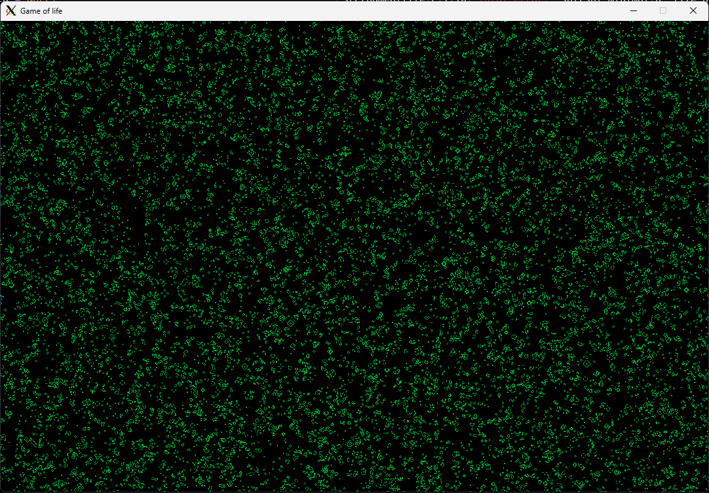

# Simple Graphics Library & GameOfLife implementation

## Simple Graphics Library

Simple graphic library is a library for constant pixels-buffer rendering.
  * SGL is based on `SDL` library.

## GameOfLife

Original rules of the game can be found in [Wikipedia](https://en.wikipedia.org/wiki/Conway%27s_Game_of_Life).

